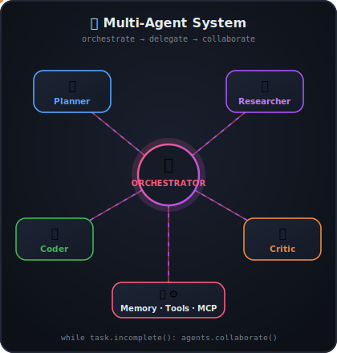
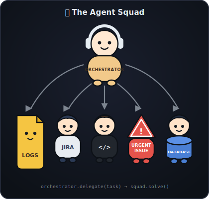

<h3 align="center">
  Welcome to Vasu's profile!
  
</h3>

<!-- Typing SVG by DenverCoder1 - https://github.com/DenverCoder1/readme-typing-svg -->
<p align="center">
  <a href="https://github.com/DenverCoder1/readme-typing-svg"></a>
</p>

<p align="center">
  <i>Teaching machines to think, plan & act — one agent at a time 🤖</i>
</p>

---


Hi, I'm **Vasu**, an **AI & Agentic AI Engineer** from Hyderabad, India. I build intelligent, autonomous systems powered by Large Language Models — from RAG pipelines and tool-using agents to full multi-agent workflows. Obsessed with making AI agents that actually **reason, plan, and get things done** in production.

- 🤖 currently building: autonomous AI agents & multi-agent systems
- 🧠 exploring: agentic reasoning, memory, planning & tool use
- 💼 any queries? do reach, [email](mailto:kasipurivasu@gmail.com) :)
- 💬 ask me anything about AI, agents, or LLMs — happy to help;

<br clear="both" />

###  A little more about me...

<table align="right" border="0">
  <tr><td></td></tr>
  <tr><td></td></tr>
</table>

```python
class Vasu:
    pronouns = ("he", "him")

    languages = [
        "Python",
        "JavaScript",
        "TypeScript",
    ]

    llms = [
        "GPT",
        "Claude",
        "Gemini",
        "Llama",
    ]

    ai_stack = [
        "LangChain",
        "LangGraph",
        "CrewAI",
        "AutoGen",
        "RAG Pipelines",
        "Pinecone / ChromaDB / FAISS",
        "Prompt Engineering",
        "Fine-tuning (LoRA / PEFT)",
    ]

    agentic_ai = [
        "Multi-Agent Systems",
        "Tool / Function Calling",
        "MCP",
        "Agent Memory & Planning",
        "Human-in-the-loop",
        "AI Evals & Guardrails",
    ]

    tools = [
        "Hugging Face",
        "OpenAI / Anthropic APIs",
        "FastAPI",
        "Docker",
        "GitHub",
        "Jupyter",
    ]

    fun_fact = (
        "My agents work 24/7 so "
        "I don't have to... 🤖"
    )
```

<br clear="both" />

## 🛠️ Tech Stack

#### 🧠 AI & LLMs
<p>
  
  
  
  
  
</p>

#### 🤖 Agentic Frameworks
<p>
  
  
  
  
  
</p>

#### 💻 Languages & Backend
<p>
  
  
  
  
  
  
</p>

#### 🗄️ Vector DBs & Tools
<p>
  
  
  
  
  
</p>

## 🚀 What I'm focused on

| Area | What I do |
|------|-----------|
| 🤝 **Multi-Agent Systems** | Teams of specialized AI agents collaborating on complex tasks |
| 📚 **RAG & Knowledge Systems** | Grounding LLMs in real data with retrieval-augmented generation |
| 🔧 **Tool-Using Agents** | Connecting LLMs to APIs & the real world via function calling and MCP |
| 🛡️ **Reliable AI** | Evals, guardrails & observability for production-grade agentic apps |

---

<p align="center">
  <i>⚡ "The best way to predict the future is to build the agents that create it."</i>
</p>
